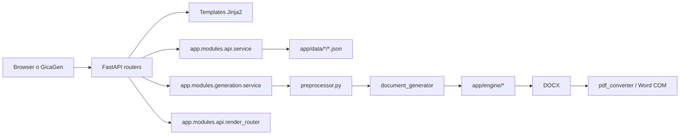

# GicaTesis - paquete de contexto actualizado

Este documento es un paquete autocontenido para dar contexto rapido a otro
agente o a ChatGPT sobre el estado real del proyecto `gicateca_tesis`.

> Actualizado: 2026-03-25
> Fuente de verdad: repo `gicateca_tesis`
> Repo acoplado: `C:\Users\jhoan\Documents\gicagen_tesis-main`

## 1. Resumen del proyecto

**GicaTesis** es el sistema que mantiene el catalogo institucional de formatos
academicos y ejecuta el render real de documentos DOCX y PDF. En este repo
viven las definiciones JSON de formatos, los contratos DTO consumidos por
GicaGen, el block engine de render y la conversion final a PDF.

En la practica, GicaTesis:

- publica formatos, version global del catalogo y assets;
- transforma JSON de formato a bloques DOCX renderizables;
- genera DOCX y PDF reales a partir de formatos publicables;
- expone rutas UI para catalogo, detalle, referencias y administracion;
- normaliza datos para que el documento final no incluya guias internas.

GicaTesis **no** orquesta prompts, historial de proyectos ni generacion IA por
secciones. Esa responsabilidad pertenece a GicaGen.

## 2. Alcance y frontera

La mejor forma de entender este repo es como el sistema de verdad del lado de
los formatos y del render institucional. El contrato con GicaGen es por HTTP y
DTOs publicos. No se debe acoplar por import directo entre repos.

Lo que pertenece a GicaTesis:

- catalogo de formatos publicables;
- detalle de formato y metadata de versionado;
- render directo DOCX/PDF;
- generacion por artefactos con `runId`;
- assets, referencias, alertas y vistas del catalogo;
- block engine y conversion PDF via Word COM.

Lo que no pertenece a GicaTesis:

- wizard SPA de 7 pasos de GicaGen;
- seleccion de prompts y proveedores IA;
- persistencia de proyectos e historial del usuario;
- presupuesto, trace y SSE de la generacion IA.

## 3. Superficies del sistema

El sistema expone tanto interfaz web como API versionada. Esto importa porque
hay dos consumidores distintos: usuarios humanos y GicaGen.

Rutas UI principales:

- `/`
- `/catalog`
- `/formatos/{id}`
- `/referencias`
- `/alerts`
- `/admin`

Rutas API principales:

- `GET /api/v1/formats`
- `GET /api/v1/formats/version`
- `GET /api/v1/formats/validate`
- `GET /api/v1/formats/{format_id}`
- `GET /api/v1/assets/{asset_path}`
- `POST /api/v1/generate`
- `GET /api/v1/artifacts/{run_id}/docx`
- `GET /api/v1/artifacts/{run_id}/pdf`
- `POST /api/v1/render/docx`
- `POST /api/v1/render/pdf`

## 4. Arquitectura actual

La arquitectura actual combina FastAPI, templates Jinja2, loaders de formatos,
servicios de catalogo y un motor de bloques para producir DOCX/PDF.



## 5. Puntos de entrada clave

Estos archivos son los puntos mas utiles para leer el repo rapido y modificarlo
sin romper contratos.

| Area | Archivo | Rol |
|---|---|---|
| bootstrap | `app/main.py` | crea FastAPI, monta static y registra routers |
| catalogo API | `app/modules/api/router.py` | formatos, version, validacion y assets |
| generacion API | `app/modules/api/generation_router.py` | `POST /generate` y descarga de artefactos |
| render API | `app/modules/api/render_router.py` | render directo DOCX/PDF |
| contratos | `app/modules/api/dtos.py` | DTOs publicos strict consumidos por GicaGen |
| catalogo | `app/modules/api/service.py` | lista formatos, calcula hashes y arma DTOs |
| generacion | `app/modules/generation/service.py` | pipeline por artefactos con TTL |
| preproceso | `app/modules/generation/preprocessor.py` | limpia guias y aplica `aiResult` |
| engine | `app/engine/` | normalizacion, registros y renderers DOCX |
| config | `app/core/settings.py` | `GICA_DEFAULT_UNI` y defaults |

## 6. Modelo de datos y catalogo actual

El catalogo real vive en `app/data/`. Hoy el inventario visible del repo es
pequeno y todavia manejable de forma manual, pero esta acoplado a contratos de
versionado y cache.

Estado actual del catalogo:

- `app/data/unac/`: 6 formatos publicables, mas `alerts.json` y
  `references_config.json`;
- `app/data/uni/`: 3 formatos publicables, mas `alerts.json` y
  `references_config.json`;
- `app/data/references/`: normas APA, IEEE, ISO690 y Vancouver;
- `app/data/schemas/`: esquemas JSON de validacion.

Los formatos publicables actuales son:

- UNAC: 2 de `informe`, 2 de `maestria`, 2 de `proyecto`;
- UNI: 1 de `informe`, 1 de `posgrado`, 1 de `proyecto`.

Los DTOs publicos estan en `app/modules/api/dtos.py` y usan
`extra="forbid"`. Los contratos mas sensibles son:

- `FormatSummary`
- `FormatDetail`
- `CatalogVersionResponse`
- `CatalogValidationResponse`

`app/modules/api/service.py` calcula hashes deterministas por formato y una
version global del catalogo. El hash considera JSON normalizado y, si existe,
el contenido binario de la plantilla asociada.

## 7. Block engine y pipeline de render

El render real sale del block engine. Este es el centro tecnico del repo y la
parte que mas facilmente rompe la salida final si se toca sin validar.

Flujo principal de generacion:

1. cargar JSON del formato por `format_id`;
2. verificar que el formato sea publicable;
3. limpiar claves de guia con `exclude_instruction_keys`;
4. fusionar `values` del usuario sobre placeholders;
5. inyectar `aiResult.sections` cuando aplica;
6. escribir JSON procesado temporal;
7. generar DOCX con `document_generator`;
8. convertir a PDF cuando el pipeline y el entorno lo permiten.

Reglas importantes del preprocesador:

- elimina `nota`, `instruccion`, `guia`, `placeholder`, `_meta`, `version` y
  otros campos no renderizables;
- limpia markdown, tablas markdown y placeholders de ejemplo del texto IA;
- aplica fallback de titulo en caratula con `values.title`,
  `project_title`, `projectTitle` o `values.project.title`;
- no deja indices ni placeholders de ejemplo contaminando el DOCX final.

Hay dos superficies de salida:

- `POST /api/v1/generate`: genera artefactos persistidos temporalmente en
  `outputs/artifacts/<run_id>` y devuelve `runId` con URLs de descarga;
- `POST /api/v1/render/docx|pdf`: responde el archivo directo en el momento.

La generacion por artefactos usa un TTL en memoria de 3600 segundos.

## 8. Contratos API importantes

La API v1 tiene dos grupos criticos: catalogo y render. Ambos son usados por
otros componentes, especialmente GicaGen.

Contratos de catalogo:

- `GET /api/v1/formats` devuelve `list[FormatSummary]`;
- `GET /api/v1/formats/version` devuelve `CatalogVersionResponse`;
- `GET /api/v1/formats/{format_id}` devuelve `FormatDetail`;
- `GET /api/v1/formats/validate` devuelve `CatalogValidationResponse`;
- `GET /api/v1/assets/{asset_path}` expone assets publicos.

Contratos de generacion y render:

- `GenerateRequest`: `projectId`, `formatId`, `formatVersion`, `mode`,
  `values`, `aiResult`;
- `GenerateResponse`: `projectId`, `runId`, `status`, `artifacts`, `error`;
- `RenderRequest`: `formatId`, `values`, `mode`, `aiResult`.

Diferencias operativas:

- `mode="simulation"` limpia guias, fusiona valores e inserta contenido IA;
- `mode="final"` usa el formato real sin sanear ni reinyectar contenido;
- `/render/pdf` en modo final depende del pipeline de cache PDF y Word COM.

## 9. Integracion con GicaGen

La relacion con GicaGen es de upstream tecnico. GicaGen consulta este repo para
obtener formatos y delega aqui la salida DOCX/PDF.

Lo que GicaGen consume de forma principal:

- `GET /api/v1/formats/version`
- `GET /api/v1/formats`
- `GET /api/v1/formats/{id}`
- `GET /api/v1/assets/{path}`
- `POST /api/v1/render/docx`
- `POST /api/v1/render/pdf`

`POST /api/v1/generate` tambien existe y es util para pruebas integradas o
flujos locales basados en artefactos, pero la integracion actual de GicaGen se
apoya sobre todo en la superficie de catalogo y render directo.

Si cambia cualquiera de estos puntos, tambien se deben revisar en el repo
hermano:

- `app/integrations/gicatesis/client.py`
- `app/integrations/gicatesis/types.py`
- `app/core/services/format_service.py`
- `app/modules/api/payload_helpers.py`

## 10. Configuracion y entorno

La configuracion relevante esta repartida entre `.env`, `app/core/settings.py`
y componentes del pipeline PDF.

Variables importantes:

| Variable | Default | Uso |
|---|---|---|
| `GICATESIS_API_KEY` | `""` | protege `/api/v1/*` con `X-GICATESIS-KEY` |
| `GICATESIS_CORS_ORIGINS` | varios localhost | CORS para clientes externos |
| `GICA_DEFAULT_UNI` | `unac` | universidad por defecto |
| `PDF_CACHE_MAX_AGE` | `3600` | vida util del cache PDF |
| `PDF_PREWARM_ON_STARTUP` | `false` | precalienta PDF al iniciar |
| `PDF_CONVERSION_TIMEOUT` | `120` | timeout del convertidor PDF |

## 11. Ejecucion local

Para ejecutar GicaTesis localmente, el flujo minimo sigue siendo simple.

```powershell
python -m venv .venv
.venv\Scripts\activate
python -m pip install -r requirements.txt
python -m uvicorn app.main:app --reload
```

Abrir:

- UI: `http://127.0.0.1:8000/`
- catalogo: `http://127.0.0.1:8000/catalog`
- referencias: `http://127.0.0.1:8000/referencias`
- OpenAPI: `http://127.0.0.1:8000/docs`

## 12. Testing y validacion

El repo tiene una capa de validacion automatizada mas pequena que GicaGen, pero
sigue siendo importante porque protege DTOs, catalogo y render.

Estado actual:

- **14 archivos de test** en `tests/`;
- scripts de validacion de datos y encoding;
- pruebas de API, catalogo, engine y generacion.

Comandos principales:

```powershell
python -m pytest tests -v
python scripts/validate_data.py
python scripts/check_encoding.py
python scripts/check_mojibake.py
```

## 13. Riesgos y hotspots

Los hotspots de este repo son mas pequenos que en GicaGen, pero el impacto de
un error es mas visible porque afecta el documento final.

- `app/modules/api/dtos.py`: cualquier cambio rompe contratos publicos;
- `app/modules/api/service.py`: versionado, hashes y mapping del catalogo;
- `app/modules/generation/preprocessor.py`: saneo y fusion de `aiResult`;
- `app/engine/`: una regresion cambia estilos, bloques o paginacion;
- `app/core/pdf_converter.py`: depende de Word COM y del entorno Windows.

## 14. Que debe saber otro agente antes de tocar este repo

Antes de modificar el repo, conviene fijar estas reglas mentales:

- GicaTesis es la fuente de verdad del catalogo y del render final;
- los DTOs v1 son contratos externos, no detalles internos;
- `simulation` y `final` no significan lo mismo y no deben mezclarse;
- PDF real depende del pipeline Word COM, no solo del DOCX;
- cualquier cambio de IDs, hashes o payloads impacta a GicaGen.

## 15. Documentos complementarios

Si otro agente necesita bajar mas a detalle, estos son los mejores siguientes
pasos dentro del repo:

- `docs/GICAGEN_INTEGRATION_GUIDE.md`
- `docs/api/formats-api.md`
- `docs/contracts/format-dto.md`
- `docs/manual/04_arquitectura.md`
- `docs/manual/16_block_engine.md`
- `docs/manual/17_validacion_y_tests.md`
