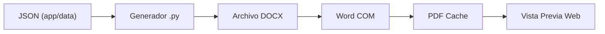

# Visión General

## ¿Qué es GicaTesis/Formatoteca?

**Formatoteca** es un sistema web para gestionar, visualizar y generar documentos académicos (tesis, informes, proyectos) para múltiples universidades peruanas (UNAC, UNI). Permite:

1. **Explorar** un catálogo de formatos disponibles.
2. **Previsualizar** carátulas e índices directamente en el navegador.
3. **Descargar** documentos DOCX generados automáticamente.
4. **Ver** normativa de referencias bibliográficas (APA, IEEE, ISO, Vancouver).

**Fuente:** `app/main.py` L39: `app = FastAPI(title="Formatoteca", version="0.1.0")`

---

## Enfoque Data-Driven

El sistema NO hardcodea los formatos ni las normas en el código Python. En su lugar:

1. **JSON define la estructura** de cada formato (`app/data/{uni}/{categoria}/*.json`).
2. **Generadores Python** (`app/universities/{uni}/centro_formatos/*.py`) leen el JSON y producen DOCX.
3. **Word COM** convierte DOCX a PDF para previsualizaciones.
4. **Cache** almacena PDFs generados para reutilización.

**Fuentes:**
- Discovery de JSON: `app/core/loaders.py` L194-275
- Conversión PDF: `app/core/pdf_converter.py` L215-217

---

## Flujo de Usuario Típico

1. **Ingresa a `/catalog`** → ve listado de formatos.
2. **Selecciona un formato** → va a `/formatos/{format_id}`.
3. **Previsualiza carátula** (botón "ojo") → Modal con datos del JSON.
4. **Previsualiza PDF** → PDF generado en cache.
5. **Descarga DOCX** → POST a `/formatos/{format_id}/generate`.

**Fuente:** `app/static/js/format-viewer.js` L35-80 (downloadDocument), L83-101 (openPdfModal), L104-195 (previewCover)
