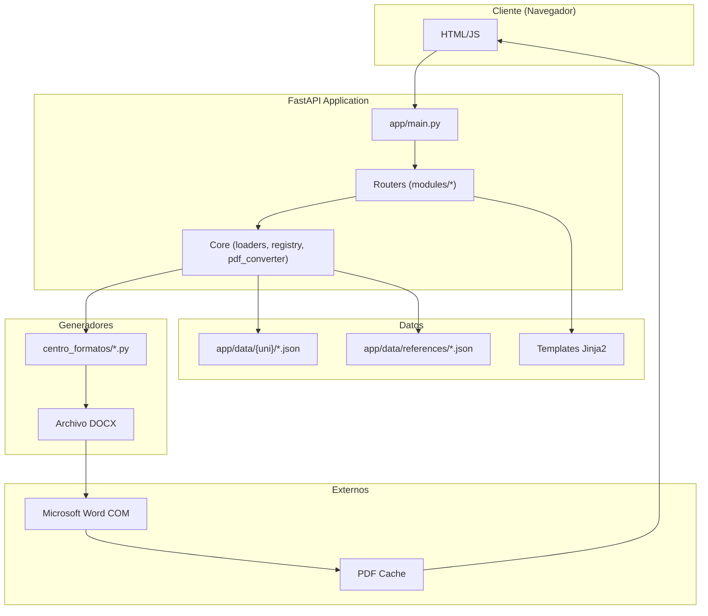

# Arquitectura del Sistema

## Diagrama de Arquitectura



---

## Pipeline de Generación de Documentos

1. **Request llega a router** (`/formatos/{id}/pdf`)
   - **Fuente:** `app/modules/formats/router.py` L380-421

2. **Service busca el formato** en el índice
   - **Fuente:** `app/modules/formats/service.py` L137-148

3. **Provider resuelve el generador** según categoría
   - **Fuente:** `app/universities/unac/provider.py` L38-42

4. **Generador Python** lee JSON y produce DOCX
   - **Fuente:** `app/modules/formats/service.py` L192-194

5. **Word COM** convierte DOCX a PDF
   - **Fuente:** `app/core/pdf_converter.py` L215-217

6. **Cache** almacena el PDF (hash SHA256 del DOCX)
   - **Fuente:** `app/modules/formats/router.py` L213-231

7. **Response** devuelve el PDF al navegador

---

## Componentes Principales

### Core (`app/core/`)

| Módulo | Responsabilidad |
|--------|-----------------|
| `loaders.py` | Discovery de JSON, normalización de IDs, detección de mojibake |
| `registry.py` | Discovery dinámico de providers en `app/universities/*/provider.py` |
| `pdf_converter.py` | Singleton Word COM con reintentos ante errores |
| `paths.py` | Rutas centralizadas (caché DOCX/PDF, data, exports) |
| `templates.py` | Configuración de Jinja2 |

**Fuentes:**
- `app/core/loaders.py` L1-344
- `app/core/registry.py` L1-106
- `app/core/pdf_converter.py` L1-219
- `app/core/paths.py` L1-69

### Providers (`app/universities/`)

Cada universidad tiene un `provider.py` que expone:

```python
PROVIDER = SimpleUniversityProvider(
    code="unac",
    display_name="UNAC",
    data_dir=get_data_dir("unac"),
    generator_map={
        "informe": BASE_DIR / "generador_informe_tesis.py",
        "maestria": BASE_DIR / "generador_maestria.py",
        "proyecto": BASE_DIR / "generador_proyecto_tesis.py",
    },
)
```

**Fuente:** `app/universities/unac/provider.py` L34-43

### Contrato UniversityProvider

```python
class UniversityProvider(Protocol):
    code: str
    display_name: str
    data_dir: Path
    
    def get_data_dir(self) -> Path: ...
    def get_generator_command(self, category: str) -> GeneratorCommand: ...
    def list_alerts(self) -> list: ...
    def list_formatos(self) -> list: ...
```

**Fuente:** `app/universities/contracts.py` L35-52

---

## Cache de PDFs

El sistema cachea PDFs basándose en el **hash SHA256 del DOCX generado**:

```
app/.cache/
+-- docx/
|   `-- unac-informe-cual.docx
`-- pdf/
    +-- unac-informe-cual-abc123def456.pdf
    `-- unac-informe-cual.manifest.json
```

**Invalidación:** Si el JSON fuente o el generador cambian (mtime), se regenera.

**Fuente:** `app/modules/formats/router.py` L70-77, L200-231
