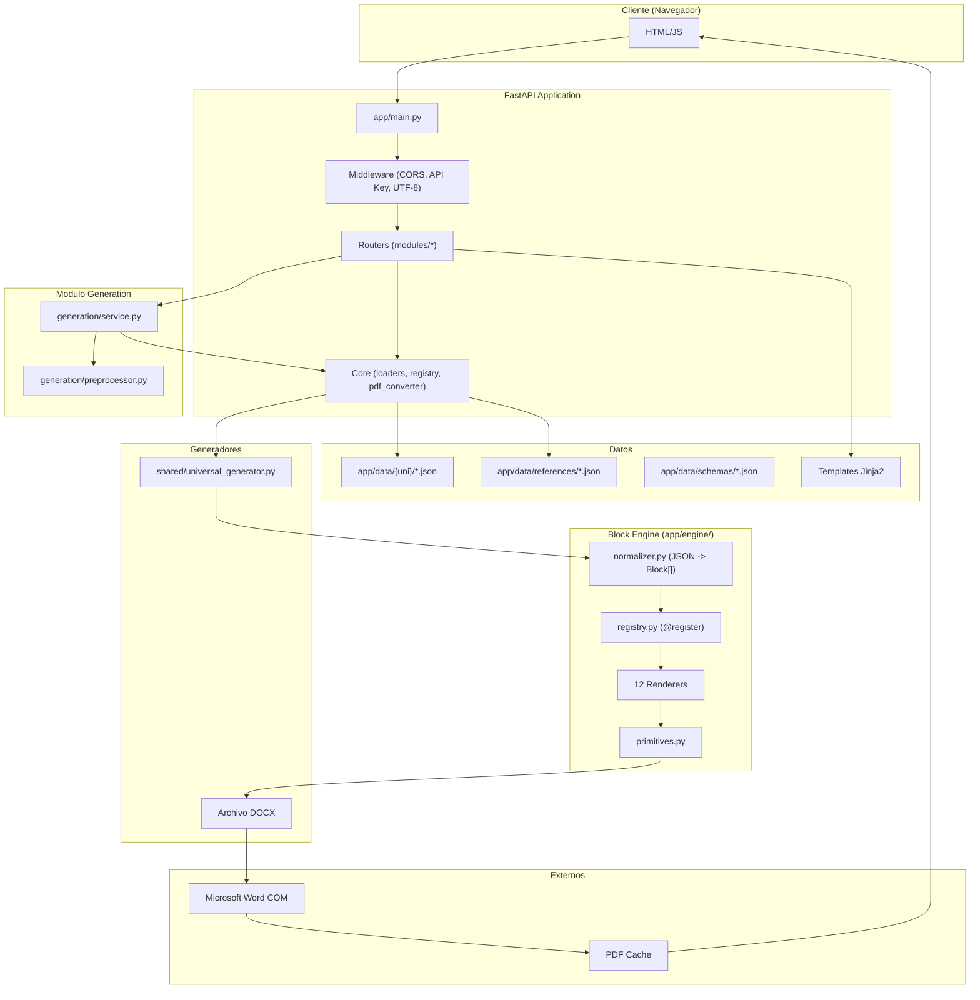

# Arquitectura del Sistema

## Diagrama de Arquitectura


```mermaid
flowchart TB
    subgraph Cliente["Cliente (Navegador)"]
        Browser["HTML/JS"]
    end

    subgraph FastAPI["FastAPI Application"]
        Main["app/main.py"]
        Middleware["Middleware (CORS, API Key, UTF-8)"]
        Routers["Routers (modules/*)"]
        Core["Core (loaders, registry, pdf_converter)"]
    end

    subgraph Engine["Block Engine (app/engine/)"]
        Normalizer["normalizer.py (JSON -> Block[])"]
        Registry["registry.py (@register)"]
        Renderers["12 Renderers"]
        Primitives["primitives.py"]
    end

    subgraph Data["Datos"]
        JSON["app/data/{uni}/*.json"]
        References["app/data/references/*.json"]
        Schemas["app/data/schemas/*.json"]
        Templates["Templates Jinja2"]
    end

    subgraph Generators["Generadores"]
        UniGen["shared/universal_generator.py"]
        DOCX["Archivo DOCX"]
    end

    subgraph GenModule["Modulo Generation"]
        GenSvc["generation/service.py"]
        Preproc["generation/preprocessor.py"]
    end

    subgraph External["Externos"]
        Word["Microsoft Word COM"]
        PDF["PDF Cache"]
    end

    Browser --> Main
    Main --> Middleware
    Middleware --> Routers
    Routers --> Core
    Routers --> GenSvc
    GenSvc --> Preproc
    GenSvc --> Core
    Core --> JSON
    Core --> References
    Routers --> Templates
    Core --> UniGen
    UniGen --> Normalizer
    Normalizer --> Registry
    Registry --> Renderers
    Renderers --> Primitives
    Primitives --> DOCX
    DOCX --> Word
    Word --> PDF
    PDF --> Browser
```

---

## Pipeline de Generacion de Documentos

1. **Request llega a router** (`/formatos/{id}/pdf` o `/api/v1/render/docx`)
   - **Fuente:** `app/modules/formats/router.py`, `app/modules/api/render_router.py`

2. **Service busca el formato** en el indice
   - **Fuente:** `app/modules/formats/service.py`

3. **Provider resuelve el generador** (universal_generator.py compartido)
   - **Fuente:** `app/universities/unac/provider.py` L39-43

4. **Generador unificado** invoca el Block Engine:
   - `normalizer.py` convierte JSON -> `List[Block]`
   - `registry.py` invoca renderers por tipo de bloque
   - 12 renderers especializados producen contenido DOCX
   - **Fuente:** `app/universities/shared/universal_generator.py`, `app/engine/`

5. **Word COM** convierte DOCX a PDF
   - **Fuente:** `app/core/pdf_converter.py`

6. **Cache** almacena el PDF (hash SHA256 del DOCX)
   - **Fuente:** `app/modules/formats/router.py`

7. **Response** devuelve el PDF al navegador

---

## Componentes Principales

### Core (`app/core/`)

| Modulo | Responsabilidad |
|--------|-----------------|
| `loaders.py` | Discovery de JSON, normalizacion de IDs, deteccion de mojibake |
| `registry.py` | Discovery dinamico de providers en `app/universities/*/provider.py` |
| `pdf_converter.py` | Singleton Word COM con reintentos ante errores |
| `paths.py` | Rutas centralizadas (cache DOCX/PDF, data, exports) |
| `settings.py` | Variables de entorno (`GICA_DEFAULT_UNI`) |
| `view_models.py` | View-models para caratulas |
| `templates.py` | Configuracion de Jinja2 |

### Block Engine (`app/engine/`)

| Modulo | Responsabilidad |
|--------|-----------------|
| `normalizer.py` | JSON canonico -> lista de bloques tipados (19 tipos) |
| `registry.py` | Decorador `@register('tipo')` + funcion `render_blocks()` |
| `primitives.py` | Funciones DOCX atomicas (fuentes, parrafos, imagenes) |
| `types.py` | Tipos `Block` y `BlockRenderer` |
| `renderers/` | 12 modulos renderer especializados |

**Fuente:** `app/engine/__init__.py`

### Generation (`app/modules/generation/`)

| Modulo | Responsabilidad |
|--------|-----------------|
| `service.py` | Orquestacion de generacion de artefactos DOCX/PDF |
| `preprocessor.py` | Sanitizacion de JSON, merge de valores, inyeccion AI |

### API (`app/modules/api/`)

| Modulo | Responsabilidad |
|--------|-----------------|
| `router.py` | Endpoints de formatos, version, validate, assets |
| `generation_router.py` | POST generate, GET artifacts |
| `render_router.py` | POST render DOCX/PDF directo |
| `dtos.py` | Pydantic DTOs (FormatSummary, FormatDetail, FormatField) |
| `service.py` | Logica de negocio (load, hash, map, filtros) |

### Providers (`app/universities/`)

Cada universidad tiene un `provider.py` que expone:

```python
PROVIDER = SimpleUniversityProvider(
    code="unac",
    display_name="UNAC",
    data_dir=get_data_dir("unac"),
    generator_map={
        "informe": SHARED_DIR / "universal_generator.py",
        "maestria": SHARED_DIR / "universal_generator.py",
        "proyecto": SHARED_DIR / "universal_generator.py",
    },
    default_logo_url="/static/assets/LogoUNAC.png",
    defaults={
        "universidad": "UNIVERSIDAD NACIONAL DEL CALLAO",
        "lugar": "CALLAO, PERU",
        "anio": "2026",
    },
)
```

**Fuente:** `app/universities/unac/provider.py` L35-51

### Contrato UniversityProvider

```python
class UniversityProvider(Protocol):
    code: str
    display_name: str
    data_dir: Path
    name: str

    def get_data_dir(self) -> Path: ...
    def get_generator_command(self, category: str) -> GeneratorCommand: ...
    def list_alerts(self) -> list: ...
    def list_formatos(self) -> list: ...
```

**Fuente:** `app/universities/contracts.py` L36-52

---

## Middleware

El sistema incluye tres middleware configurados en `app/main.py`:

| Middleware | Proposito |
|------------|-----------|
| **CORS** | Permite origenes configurados via `GICATESIS_CORS_ORIGINS` |
| **API Key** | Si `GICATESIS_API_KEY` esta definida, valida `X-GICATESIS-KEY` en `/api/v1/*` |
| **UTF-8** | Garantiza charset UTF-8 en respuestas text/JSON |

**Fuente:** `app/main.py` L48-99

---

## Cache de PDFs

El sistema cachea PDFs basandose en el **hash SHA256 del DOCX generado**:

```
app/.cache/
+-- docx/
|   `-- unac-informe-cual.docx
`-- pdf/
    +-- unac-informe-cual-abc123def456.pdf
    `-- unac-informe-cual.manifest.json
```

**Invalidacion:** Si el JSON fuente o el generador cambian (mtime), se regenera.

**Fuente:** `app/modules/formats/router.py`
