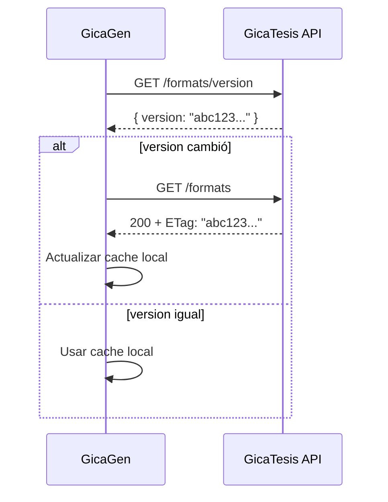

# Versioning & Cache Strategy

Cómo funciona el versionado y cache de la API de Formatos.

## Conceptos Clave

### formatHash (por formato)

Hash SHA-256 del **contenido real** de un formato:
- JSON normalizado (metadata, campos, assets)
- Bytes del template (si existe)

**NO depende de:**
- Paths internos
- Timestamps de modificación (mtimes)
- Orden de archivos en disco

### catalogVersion (global)

Hash SHA-256 de todos los `formatHash` ordenados por ID:

```
sha256(
  "unac:format-a:<hash-a>\n" +
  "unac:format-b:<hash-b>\n" +
  ...
)
```

---

## Flujo de Cache (GicaGen)



---

## Headers HTTP

### Request
```
If-None-Match: "abc123..."
```

### Response (sin cambios)
```
HTTP/1.1 304 Not Modified
ETag: "abc123..."
Cache-Control: public, max-age=60
```

### Response (con cambios)
```
HTTP/1.1 200 OK
ETag: "def456..."
Cache-Control: public, max-age=60
Content-Type: application/json

[...]
```

---

## Estrategia Recomendada para GicaGen

1. **Al iniciar**: Llamar `GET /formats/version` para obtener versión actual.
2. **Comparar** con versión guardada en localStorage/DB.
3. **Si difiere**: Llamar `GET /formats` para actualizar catálogo completo.
4. **Guardar** nueva versión + datos.
5. **En requests posteriores**: Enviar `If-None-Match` con versión guardada.

---

## Cálculo de Hash (detalles técnicos)

### Serialización Canónica
```python
json.dumps(obj, sort_keys=True, separators=(",", ":"))
```

- Keys ordenadas alfabéticamente
- Sin espacios
- Unicode estable

### Hash de Formato
```python
hasher = hashlib.sha256()
hasher.update(canonical_json(normalized_metadata))
hasher.update(template_file_bytes)  # si existe
return hasher.hexdigest()
```

### Hash de Catálogo
```python
pairs = sorted([f"{id}:{hash}" for ...])
return sha256("\n".join(pairs))
```

---

## Cuándo Cambia la Versión

| Cambio | ¿Invalida cache? |
|--------|------------------|
| Editar JSON de formato | ✅ Sí |
| Modificar template DOCX | ✅ Sí |
| Mover carpeta sin cambiar contenido | ❌ No |
| Agregar nuevo formato | ✅ Sí |
| Cambiar timestamp sin cambiar contenido | ❌ No |

---

## TTL Recomendados

| Recurso | TTL | Razón |
|---------|-----|-------|
| `/formats` | 60s + ETag | Balancear frescura y performance |
| `/formats/{id}` | 60s + ETag | Igual que lista |
| `/formats/version` | 30s | Check rápido, puede ser más frecuente |
| `/assets/*` | 24h | Assets son muy estables |
